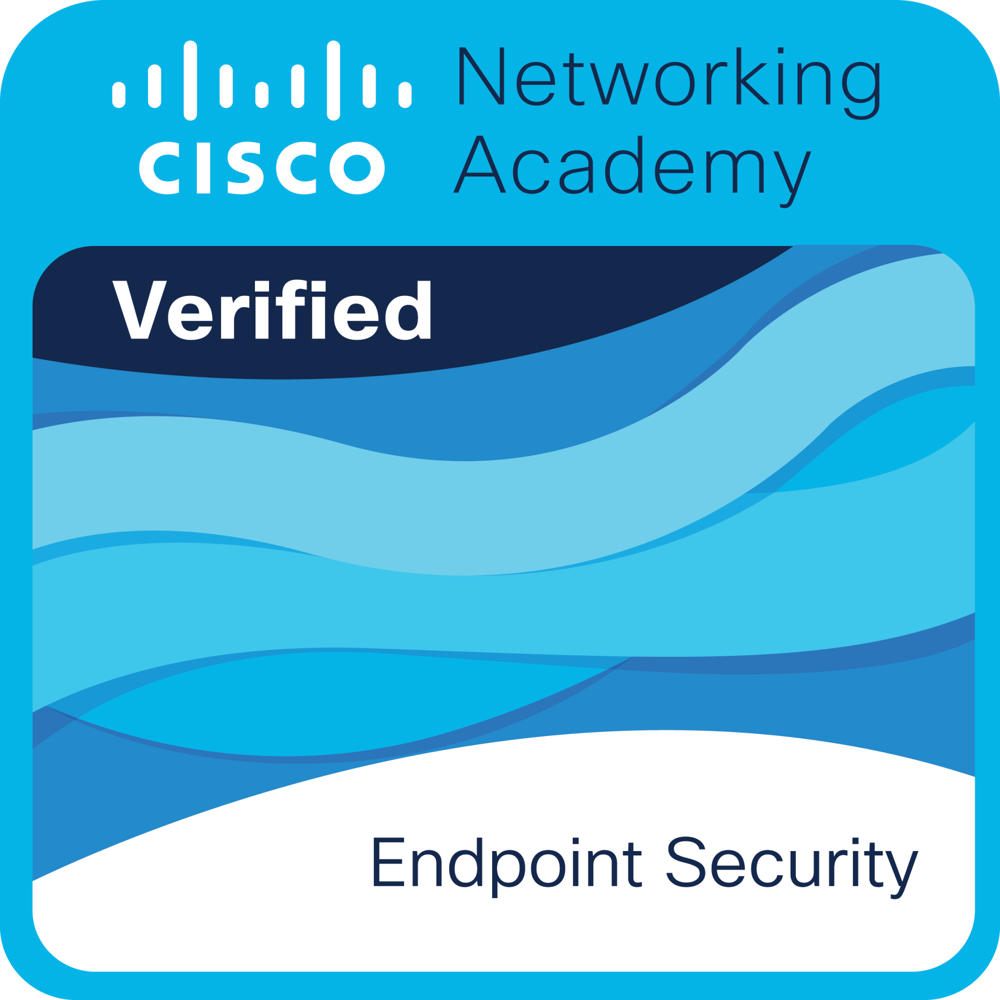

Currently a 3rd-semester undergraduate in Systems Analysis and Development at GRAN FACULDADE (Gran Concursos). I have participated and continue to participate in some programs that are contributing to my professional development, some of them are:  <strong>* Web DIO </strong>.  <strong>* ONE ORACLE + Alura - Front-End Specialization
Technical Training and Soft Skills (completed)</strong>. </strong>* Skill for All by Cisco Networking Academy (partner of the university)</strong>.  </strong>* Hackers Do Bem Program - GOV. BR.</strong>  

I am interested in both front-end and back-end development, and my main programming languages are HTML, CSS, JavaScript, and MySQL (I am continually improving in React/AI/TypeScript/among other technologies). 
I constantly study and stay up to date in the field of technology because I love learning and using my knowledge to create innovative solutions!

<h3 align="left">Connect with me!</h3>

<h3 align="left">My Stack</h3>

  
  
  
  
  
  
  
  
  
  
  
  
  
  
  
  
  
  
  
  
  
  

<h3>GitHub Stats</h3>

 
<!---
VBDOL/VBDOL is a ✨ special ✨ repository because its `README.md` (this file) appears on your GitHub profile.
You can click the Preview link to take a look at your changes.
--->
<picture>
  <source media="(prefers-color-scheme: dark)" srcset="https://raw.githubusercontent.com/VBDOL/VBDOL/output/github-contribution-grid-snake-dark.svg">
  <source media="(prefers-color-scheme: light)" srcset="https://raw.githubusercontent.com/VBDOL/VBDOL/output/github-contribution-grid-snake.svg">
  
</picture>
  

  
Alura
 

### 🏅 Badges & Certificados - Alura

<table style="text-align: center;">
  <tr>
    <td>
      
    </td>
    <td>
      
    </td>
    </tr>
    <tr>
    <td>Challenge Portfólio</td>
    <td>Challenge Alura Geek</td>
  </tr>
</table>

Cisco

### 🏅 Badges & Certificados - Cisco Networking Academy

<table style="text-align: center;">
  <tr>
    <td>
      
    </td>
    <td>
      
    </td>
    <td>
      
    </td>
  </tr>
  <tr>
    <td>Challenge End Point Security</td>
    <td>Challenge Networking Academy </td>
    <td>Challenge Networking Basics</td>
  </tr>
</table>

Hackers do Bem

### 🏅 Badges & Certificados - Hackers do Bem

<table style="text-align: center;">
  <tr>
    <td>
      
    </td>
    <td>
      
    </td>
  </tr>
    <tr>
    <td>HDB Nivelamento</td>
    <td>HDB Básico</td>
    </tr>
</table>

Microsoft Learn

  
### 🏅 Badges & Certificados - Microsoft Learn

<table style="text-align: center;">
  <tr>
    <td>
      
    </td>
    <td>
      
    </td>
  </tr>
    <tr>
    <td></td>
    <td></td>
    </tr>
</table>

SoloLearningn

  
### 🏅 Badges & Certificados - SoloLearning

<table style="text-align: center;">
  <tr>
    <td>
      
    </td>
    <td>
      
    </td>
  </tr>
    <tr>
    <td></td>
    <td></td>
    </tr>
</table>

Mimo

  
### 🏅 Badges & Certificados - Mimo

<table style="text-align: center;">
  <tr>
    <td>
      
    </td>
    <td>
      
    </td>
  </tr>
    <tr>
    <td></td>
    <td></td>
    </tr>
</table>

GrassHopper

  
### 🏅 Badges & Certificados - GrassHopper

<table style="text-align: center;">
  <tr>
    <td>
      
    </td>
    <td>
      
    </td>
  </tr>
    <tr>
    <td></td>
    <td></td>
    </tr>
</table>

Curso em Video

  
### 🏅 Badges & Certificados - Curso em Video

<table style="text-align: center;">
  <tr>
    <td>
      
    </td>
    <td>
      
    </td>
  </tr>
    <tr>
    <td></td>
    <td></td>
    </tr>
</table>

Web DIO

### 🏅 Badges & Certificados - Web DIO
<table style="text-align: center;">
  <tr>
    <td>
      
    </td>
    <td>
      
    </td>
  </tr>
    <tr>
    <td></td>
    <td></td>
    </tr>
</table>

  
Made with 💜 by <a href="https://github.com/VBDOL">VBDOL.DEV</a>.

